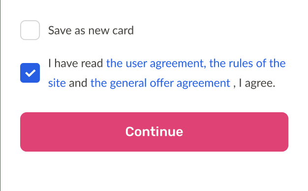

# Localized RichText Plus

Localized RichText package lets you localize your RichText.

## Installation

1. Add the latest version of package to your pubspec.yaml (and run`dart pub get`):
```yaml
dependencies:
  localized_rich_text_plus: ^0.0.1
```
2. Import the package and use it in your Flutter App.
```dart
import 'package:localized_rich_text_plus/localized_rich_text_plus.dart';
```

## Examples of How To Use the package

- default parameter - You pass your full text here
- originalText - specific word or phrase will be changed
- localizedText - specific word or phrase will be localized to
- style - Custom TextStyle if necessary to add

<hr>


```dart
import 'package:flutter/material.dart';
import 'package:localized_rich_text_plus/localized_rich_text_plus.dart';

class LocalizedWidget extends StatelessWidget {
  const LocalizedWidget({Key? key}) : super(key: key);

  @override
  Widget build(BuildContext context) {
    return LocalizedRichText(
      const Text(
        'I have read paymentRulesText and paymentContractText, I agree.',
        style: TextStyle(
          fontSize: 18,
        ),
      ),

      richTexts: [
        LocalRichText(
          originalText: 'paymentRulesText',
          localizedText: 'the user agreement, the rules of the site',
          style: const TextStyle(
            fontSize: 20,
            fontWeight: FontWeight.w700,
          ),
          onTap: () => {print("clicked")},
        ),
        LocalRichText(
          originalText: 'paymentContractText',
          localizedText: 'the general offer agreement',
          style: const TextStyle(
            fontSize: 20,
            fontWeight: FontWeight.w700,
          ),
          onTap: () => {print("clicked")},
        ),
      ],
    );
  }
}
```

## Screenshot




<hr>
Referenced from these packages

- [Easy Rich Text](https://pub.dev/packages/easy_rich_text)

